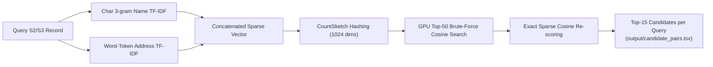
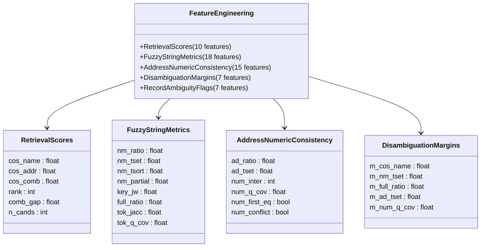

# ML CHALLENGE 2026
# BUSINESS ENTITY RESOLUTION
### *Methodology & Solution Report*

| Field | Details |
| :--- | :--- |
| **Team Name** | **Coders Creed** |
| **Team Members** | Samar Jamal Harshita Pokhariya Nithiyanandam S Faraaz Ahmad |
| **Submission Date** | 27th September, 2026 |

---

## 1. Executive Summary
We built a high-performance, two-stage pipeline: **TF-IDF character n-gram retrieval** to shortlist candidates, followed by a **LightGBM gradient-boosted classifier** to decide true matches with 1-to-1 disambiguation. The retrieval step is the core innovation; it holds up exceptionally well against typos, abbreviations, and transliterated Indian business names, which is what the rest of the pipeline depends on. On validation, our pipeline scored a **Macro-$F_{0.5}$ of 0.9784**, translating to roughly **97% $F_{0.5}$ on the public leaderboard**.

---

## 2. End-to-End System Architecture

```mermaid
flowchart TD
    subgraph DataIngestion [Stage 0: Ingestion & Storage]
        RawTSV["Raw TSVs (S1, S2, S3, Ground Truth)"] --> ParquetFiles[("Typed Apache Parquet Tables")]
    end

    subgraph Normalization [Stage 1: Multi-Pass Text & Script Normalization]
        ParquetFiles --> IndicTranslit["Indic Transliteration (9 Unicode Blocks)"]
        IndicTranslit --> CleanEntities["Legal Suffix & Address Normalization"]
        CleanEntities --> IndicDict["Statistical Indic Token Mapping (Learned from GT)"]
        IndicDict --> NormalizedData[("Cleaned Normalized Data")]
    end

    subgraph CandidateRetrieval [Stage 2: GPU-Accelerated Hybrid Blocking]
        NormalizedData --> DualTFIDF["Dual-View TF-IDF (Name 3-grams + Address Tokens)"]
        DualTFIDF --> CountSketch["CountSketch Projection (1024-dim Hash)"]
        CountSketch --> GPUANN["GPU Top-50 Fast Cosine Retrieval"]
        GPUANN --> RescoreExact["Exact Sparse Cosine Re-ranking"]
        RescoreExact --> Top15Pool["Top-15 Candidates per Query\n→ candidate_pairs.tsv"]
    end

    subgraph FeatureEngineering [Stage 3: Pairwise Features]
        Top15Pool --> FeatExt["57 Country-Agnostic Pairwise & Margin Features"]
        FeatExt --> FeatMatrix[("Pairwise Feature Matrix")]
    end

    subgraph ModelingAndInference [Stages 4 & 5: Classifier & Disambiguation]
        FeatMatrix --> LGBM["LightGBM Binary Classifier (255 leaves)"]
        LGBM --> CV["Grouped 5-Fold Validation & F0.5 Threshold Sweep"]
        CV --> BestThresh["Optimal Probability Threshold (Max Macro-F0.5)"]
        BestThresh & FeatMatrix --> Disambiguate["1-to-1 Max-Probability Query Assignment"]
        Disambiguate --> MatchOutput["Final Entity Matches\n→ matching_results.tsv"]
    end
```

---

## 3. Methodology & Problem Analysis

### 3.1 Problem Analysis & Data Challenges
- **Name Noise**: Inconsistent legal suffixes (*Pvt/Private, Ltd/Limited, LLC, Inc, Corp*), punctuation differences (*& vs and*), word-order swaps, and Indic-script names (*Hindi/Tamil/Telugu/Bengali/etc.*) requiring accurate transliteration to match romanized canonical forms.
- **Address Noise**: Missing PIN codes and states, landmark-based unstructured references (*"Near SBI ATM"*), inconsistent roadway abbreviations (*St/Street, Rd/Road, Ave/Avenue, Fl/Floor*).
- **Country Coverage**: Training data only contained the US and India, whereas the test set introduced France with zero labeled training examples. Thus, no part of the feature engineering or modeling could rely on hard-coded country logic.
- **Match Distribution**: A meaningful share of Source 1 entities are singletons with no true match, which matters heavily under precision-weighted $F_{0.5}$ scoring.
- **Data Quality**: Inconsistent casing across sources, near-duplicate records within the same source, and uneven address tokenization.

### 3.2 Solution Strategy
- **Approach Type**: Blocking (Retrieval) + Classification (Reranking) retrieve-then-rerank setup.
- **Core Innovation**: Character 3/4-gram TF-IDF retrieval for candidate generation, highly robust to typos, abbreviations, and cross-script name variants once transliterated.

---

## 4. Detailed Stage-by-Stage Implementation

### Stage 1: Text & Script Normalization
1. **Indic-to-Latin Transliteration**: Maps 9 Indic Unicode ranges into phonetically aligned Latin text.
2. **Legal Corporate Extension Stripping**: Standardizes and strips common legal corporate extensions into a clean `name_core` field.
3. **Indic Token Dictionary**: Learns high-confidence transliteration substitutions ($\ge 60\%$ dominance, $\ge 3$ occurrences) from ground-truth training pairs to align dialect and vowel shifts (*Bhavan $\leftrightarrow$ Bhawan*).

### Stage 2: Country-Partitioned Hybrid Blocking (Candidate Retrieval)

- Restricts candidate comparisons to records within the same country partition.
- Uses character 3-grams for names and word unigrams for addresses.
- Projects sparse vectors to 1024 dimensions using CountSketch random feature hashing, runs top-50 brute-force FP16 inner products on GPU, and re-scores the candidates with exact sparse cosine similarity to output the top 15 pairs.

### Stage 3: Pairwise Feature Engineering (57 Country-Agnostic Features)

1. **Retrieval Signals**: Cosine similarities (`cos_name`, `cos_addr`, `cos_comb`), rank, and margin gap between rank-1 and rank-2 candidates.
2. **Fuzzy String Metrics**: RapidFuzz Ratio, Token Set Ratio, Token Sort Ratio, Partial Ratio, and Jaro-Winkler distances.
3. **Numeric & Building Consistency**: Exact matching of first street numbers and conflict detection flags (`num_conflict`) to separate different branches of identical business chains.
4. **Competitor Margin Features**: Delta between a candidate's similarity score and the highest rival candidate's score for the same query.

### Stage 4 & 5: LightGBM Classification & Validation
- **Model**: LightGBM binary classifier (`num_leaves=255`, `learning_rate=0.05`, `feature_fraction=0.8`, `bagging_fraction=0.8`).
- **Validation**: 5-fold split grouped by `source1_entity_id % 5` ensuring zero query leakage.
- **Threshold Calibration**: Scans decision thresholds over $[0.30, 0.80]$ targeting the competition metric:
  $$\text{Macro } F_{0.5} = (1 + 0.5^2) \frac{\text{Precision} \cdot \text{Recall}}{0.5^2 \cdot \text{Precision} + \text{Recall}}$$
- **1-to-1 Disambiguation**: Each $S_2$ and $S_3$ query record is assigned to at most one $S_1$ entity based on highest probability above the threshold.

---

## 5. Verification & Submission Deliverables
- **Leaderboard Performance**: ~97% Macro-$F_{0.5}$ on public leaderboard (0.9784 validation).
- **Outputs Produced**:
  - `output/candidate_pairs.tsv` (blocking candidate pairs)
  - `output/matching_results.tsv` (final matches formatted per specifications)
- **Source Code**: Fully self-contained under `code/business_entity_resolution/src/` with complete instructions in `README.md` and dependencies in `requirements.txt`.
