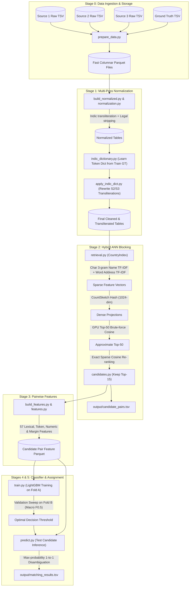

# End-to-End Business Entity Resolution Pipeline

[](https://www.python.org/)
[](https://lightgbm.readthedocs.io/)
[](https://pola.rs/)
[](https://pytorch.org/)

This codebase contains the complete, self-contained, reproducible pipeline for **Amazon ML Challenge 2026: Business Entity Resolution**. The task is to match noisy entity records from heterogeneous sources (`Source 2` and `Source 3`) against canonical corporate entities in `Source 1` across multiple global countries and languages.

---

## 1. High-Level System Architecture

The pipeline processes raw entity tables through a multi-stage architecture: ingestion, domain-aware normalization, GPU-accelerated candidate blocking, pairwise feature extraction, and gradient boosted ranking with strict 1-to-1 competition assignment.



---

## 2. Directory Layout & Module Responsibilities

```text
code/business_entity_resolution/
├── requirements.txt           # Pinned python dependencies
├── README.md                  # Comprehensive reproduction and execution guide
└── src/                       # Self-contained source code modules
    ├── config.py              # Path definitions and environment variable controls
    ├── prepare_data.py        # Stage 0: Converts raw TSVs into typed Parquet chunks
    ├── normalization.py       # Regex engines, transliteration, legal suffix stripping
    ├── build_normalized.py    # Stage 1: Multiprocess normalization runner
    ├── indic_dictionary.py    # Stage 1b: Learns cross-lingual token alignment mapping
    ├── apply_indic_dict.py    # Stage 1c: Applies token replacement to S2 and S3 queries
    ├── retrieval.py           # TF-IDF vectorizers and GPU CountSketch index
    ├── candidates.py          # Stage 2: Country-partitioned candidate retrieval (blocking)
    ├── features.py            # Definitions for 57 country-agnostic pairwise features
    ├── build_features.py      # Stage 3: Vectorized extraction of pairwise candidate features
    ├── metrics.py             # Official Macro-F0.5 evaluation implementation
    ├── train.py               # Stage 4: LightGBM training with 5-fold CV threshold tuning
    ├── predict.py             # Stage 5: Inference, 1-to-1 resolution & TSV generation
    └── run_all.py             # Master orchestrator executing Stages 0 through 5
```

---

## 3. Environment & Hardware Requirements

### System Specifications
* **Operating System**: Linux (Ubuntu 20.04+ recommended) or Windows 10/11.
* **Python Version**: Python 3.10, 3.11, or 3.12.
* **RAM**: 16 GB minimum (32 GB recommended for full candidate materialization).
* **GPU**: NVIDIA GPU with CUDA 12+ and 8+ GB VRAM recommended for fast approximate nearest neighbor blocking via CountSketch. *(If no GPU is present, PyTorch automatically executes on CPU)*.

### Setup Instructions

```bash
# 1. Navigate to the code directory
cd code/business_entity_resolution

# 2. Initialize and activate virtual environment
python -m venv venv
# Linux/macOS:
source venv/bin/activate
# Windows (PowerShell):
.\venv\Scripts\Activate.ps1

# 3. Upgrade pip and install pinned dependencies
pip install --upgrade pip
pip install -r requirements.txt
```

*(Optional: Enable CUDA 12.4 acceleration for PyTorch)*
```bash
pip install torch==2.6.0 --index-url https://download.pytorch.org/whl/cu124
```

---

## 4. Environment Variables & Path Configuration

All system paths are fully customizable without modifying source code via environment variables defined in [`src/config.py`](file:///c:/Users/COMP/OneDrive/Desktop/Projects/_submission/code/business_entity_resolution/src/config.py):

| Environment Variable | Description | Default Location |
| :--- | :--- | :--- |
| `ER_DATA_DIR` | Directory containing `train/` and `test/` TSV folders | `../../dataset/6ab10eb3b23ba_student_resource/student_resource/dataset` |
| `ER_CACHE_DIR` | Scratch folder for intermediate Parquets and models | `./pipeline_cache` |
| `ER_OUTPUT_DIR` | Target folder where final TSVs are saved | `../../output` |
| `LGBM_THREADS` | Number of CPU threads used by LightGBM | Detected CPU cores (default: 8) |

**Example configuration on Linux/macOS:**
```bash
export ER_DATA_DIR="/data/amazon_ml_challenge/dataset"
export ER_CACHE_DIR="/data/scratch/pipeline_cache"
export ER_OUTPUT_DIR="../../output"
```

**Example configuration on Windows PowerShell:**
```powershell
$env:ER_DATA_DIR="C:\Data\AmazonML\dataset"
$env:ER_OUTPUT_DIR="c:\Users\COMP\OneDrive\Desktop\Projects\_submission\output"
```

---

## 5. End-to-End Reproduction Workflow

To execute the entire pipeline from scratch, navigate to the `src` directory and trigger the master script:

```bash
cd src
python run_all.py
```

### Detailed Execution of Pipeline Stages

Each stage can also be executed independently. Intermediate checkpoints are automatically cached:

#### Stage 0: Raw Ingestion (`prepare_data.py`)
Converts raw tab-delimited files into optimized Parquet tables.
```bash
python prepare_data.py
```
- Ingests `train_source1.tsv`, `train_source2.tsv`, `train_source3.tsv`, `train_ground_truth.tsv` and corresponding test files.
- Enforces strict data types and schema validation.

#### Stage 1: Domain-Specific Normalization (`build_normalized.py`)
```bash
python build_normalized.py
```
- **Indic Script Transliteration**: Maps 9 Unicode Indic blocks (Devanagari, Bengali, Gurmukhi, Gujarati, Oriya, Tamil, Telugu, Kannada, Malayalam) into phonetic Latin equivalents.
- **Corporate Suffix Removal**: Strips legal designators (e.g. *Ltd, Pvt Ltd, LLC, Inc, Corp, Gmbh, SA, SpA, BV*).
- **Address Canonization**: Standardizes US, Indian, and international street indicators, directions, and locality abbreviations.
- **Indic Token Alignment (`indic_dictionary.py` & `apply_indic_dict.py`)**: Mines ground truth pairs to uncover statistical token substitutions (e.g. phonetically shifted names) and rewrites test query records.

#### Stage 2: Dual-View TF-IDF & GPU CountSketch Blocking (`candidates.py`)
```bash
python candidates.py
```
- Creates independent indexes per country partition to bound memory usage.
- Dual sparse representation:
  - **Name View**: Character 3-grams of space-stripped corporate names.
  - **Address View**: Word tokens of normalized addresses.
- Generates top-15 candidate canonical entities for each query record.
- Writes candidate pairs directly to `output/candidate_pairs.tsv`.

#### Stage 3: Vectorized Feature Engineering (`build_features.py`)
```bash
python build_features.py
```
Extracts 57 country-agnostic pairwise signals across all candidate pairs:
1. **Retrieval Scores**: Cosine name similarity, address similarity, combined score, rank, score gap to rank 1.
2. **Fuzzy String Metrics**: RapidFuzz Ratio, Token Set Ratio, Token Sort Ratio, Partial Ratio, Jaro-Winkler distance.
3. **Token Overlap & Coverage**: Shared token count, Jaccard token similarity, query token coverage in candidate.
4. **Numeric & Address Verification**: Set equality of numeric tokens, conflict detection in house/building numbers, missing address flags.
5. **Rival Candidate Margins**: Delta between candidate similarity and the highest-scoring rival candidate for the same query.

#### Stage 4: LightGBM Training & F0.5 Sweeping (`train.py`)
```bash
python train.py
```
- Partitions training entities into 5 deterministic folds based on `entity_id % 5`.
- Trains a gradient boosted tree on 4 folds using binary logistic objective:
  - `num_leaves=255`, `learning_rate=0.05`, `feature_fraction=0.8`, `bagging_fraction=0.8`.
- Evaluates Macro-$F_{0.5}$ on the held-out validation fold across thresholds $[0.30, 0.80]$ in increments of $0.01$ to identify the optimal cutoff.

#### Stage 5: Inference & Output Generation (`predict.py`)
```bash
python predict.py
```
- Applies the trained booster and optimal threshold to the test set.
- Enforces competition-aware constraints: each $S_2$ and $S_3$ query record is assigned to at most one $S_1$ entity.
- Aggregates matched queries per $S_1$ entity and produces the final test predictions:
  * `output/matching_results.tsv` (formatted as `source1_entity_id \t matched_entity_ids`).
